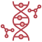

# Proof of Evolution (PoE)
Demonstrative implementation of a new consensus protocol for blockchains. This protocol allows the execution of user-defined *Genetic Algorithms* (GAs) while mining, keeping all the security properties of PoW. This implementation has been used in the testing phase of a study I have conducted for my master's degree thesis, and summarized in a [paper][1].

## Motivation
Proof of Work (PoW) is still one of the most used consensus protocols in blockchains, because of its security properties. However, in order to keep the system working, it requires a huge amount of computations, that results in a huge energy consumption. For this reason, new consensus protocols have been developed since the birth of Bitcoin, to make blockchains more sustainable.

These alternative consensus protocols can be subdivided in two cathegories:
- The ones that reduce the amount of computation requested in mining (For example [Proof of Stake][4],[Proof of Space][5],[Proof of Elapsed Time][6]).
- The ones that do not reduce the computations, but that earmark part of them for useful tasks (For example [Proof of Useful Work][7], [Proof of Learning][8], [Proof of Search][9]).

In any case, few of these protocols can guarantee the same security properties of PoW. Their security is based on different assumptions and should be evaluated in the application context.

PoE, instead, can be seen as an extension of PoW (in a way similar to Proof of Search), that keeps all the security properties of PoW unchanged and, at the same time, allows the execution of GAs during mining. These GAs can be submitted by users through transactions, and thus be useful for someone.

## The idea
The core idea of PoE is to use the mining proof to proove that a statistically great number of individuals of a GA instance has been evaluated through a fitness function. To do so, the numeric nonce of each block in PoW is replaced by a nonce made of a triple `("individual","fitness score","complexity")`, where:
- **individual** is one of the possible solutions to the problem in consideration
- **fitness score** is the output of the fitness function of the GA,  with that individual in input
- **complexity** is an estimation of the number of primitive function used in the execution of the fitness function, with a small randomic offset that depends on the miner's public key and on the block's hash (to prevent reuse of precalculated scores).

The requirements that are requested to the hash of the blockcs are the same of PoW, the only difference is the structure of the nonce. Thus, PoW's main properties remain the same, because the core of the algorithm is not changed.

Any user of the blockchain, in addition to standard transactions, can submit *Job transactions*, in which he can specify GAs. These GAs will then be selected by the blockchain to validate a block, and the proof would be a triple nonce with an individual, its score and its complexity, whose insertion in the block makes the hash matching the mining requirements.

Moreover, miners can take note of the individuals with the best fitness score they find, and submit the best ones with a transactions. In this way they can share a subset of the population and increase the possibilies to reach the optimal solution through cooperation. The user who submitted the GA will give a prize to reward the miners who find the best solution, or contributed in finding it. This prize, in any case, is independent from the mining process. For more details I remand to the [paper][1].

## Execution requirements
In order to run the client or the miner application, you need to install in your system a working [Go][2] environment. In addition, you have to check that [plugin execution][3] is supported in your system, by your version of Go. No other libraries are required, except for the go standard ones.

## How to create a wallet
To interact with the blockchain as a client, you need a wallet.

The first step to create a wallet is to edit `conf/config0.json`. You should set the folder in which to store the blockchain's data. You should also check the existance of the subfolders `<mainDataFolder>/<keyFolder>` and `<mainDataFolder>/<jobFolder>` (or create that folders).

Then, you can generate an RSA key pair running `go run poe_client.go -mode genkey`. You can generate more than one key pair.

At this point, you should set the "key" property in `conf/config0.json` to the key pair to use, and the "port" property to the port at which your mining node will be active. You should link a working mining node in order to interact with the blockchain. You should also link some other nodes, that will interact with your main node.  

Finally you can run `go run poe_client.go -mode wallet -conf conf/configXX.json` to run the wallet, initialized with `conf/configXX.json` configuration file (replace `XX` with the one of your choice).

## How to start a mining node
To initialize a mining node you need to create a wallet first (see the previous section). Once you have a wallet, you can start mining running `go run poe_miner.go -conf conf/configXX.json`. You have to link the same configuration file of the wallet.

## Available commands
Once you execute a client instance in wallet mode, you have access to a textual user interface, where you can type the following commands:
- `total`: to get the current balance of the wallet.
- `money <amount> <receiver>`: to send coins to another wallet. The `<amount>` should be the number of coins to transfer, and the `receiver` the string representation of the public key of the receiver.
- `estimate <job> <data>`: to estimate the minimum prize for a job. The `<job>` parameter should be the path to the job source code, and `<data>` the path (or the URL) to the data of the job.
- `job <job> <data> <prize>`: to submit a job. The `<job>` parameter should be the path to the job source code, `<data>` the path (or the URL) to the data of the job, and `<prize>` the amount of the prize for the job.
- `jobs`: to get the list of submitted jobs and their IDs.
- `results <jobID>`: to get the results miners have calculted for a submitted job. The `<jobID>` parameter should be the ID of the job reported in the output of `jobs` command.

## How to define a Job
In order to define a job, users must implement [DNA][10] and [Problem][11] interfaces. The implementation of the DNA interface is in practice the implementation of a GA. In the definition of the Evaluate function (which is used as fitness function), users are required to use only a combination of the set of primitive functions that are defined in [op package][12] (More details on [paper][1]).

[1]: https://github.com/D33pBlue/poe
[2]: https://golang.org/
[3]: https://golang.org/pkg/plugin/
[4]: https://en.wikipedia.org/wiki/Proof_of_stake
[5]: https://en.wikipedia.org/wiki/Proof_of_space
[6]: https://www.researchgate.net/publication/320246838_On_Security_Analysis_of_Proof-of-Elapsed-Time_PoET
[7]: https://arxiv.org/abs/2001.09244
[8]: https://ieeexplore.ieee.org/document/8783030
[9]: https://deepai.org/publication/blockchain-consensus-formation-while-solving-optimization-problems
[10]: https://github.com/D33pBlue/poe/blob/master/ga/dna.go
[11]: https://github.com/D33pBlue/poe/blob/master/ga/loader.go
[12]: https://github.com/D33pBlue/poe/tree/master/op
